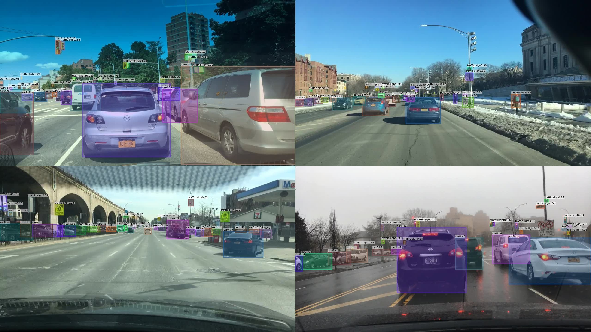
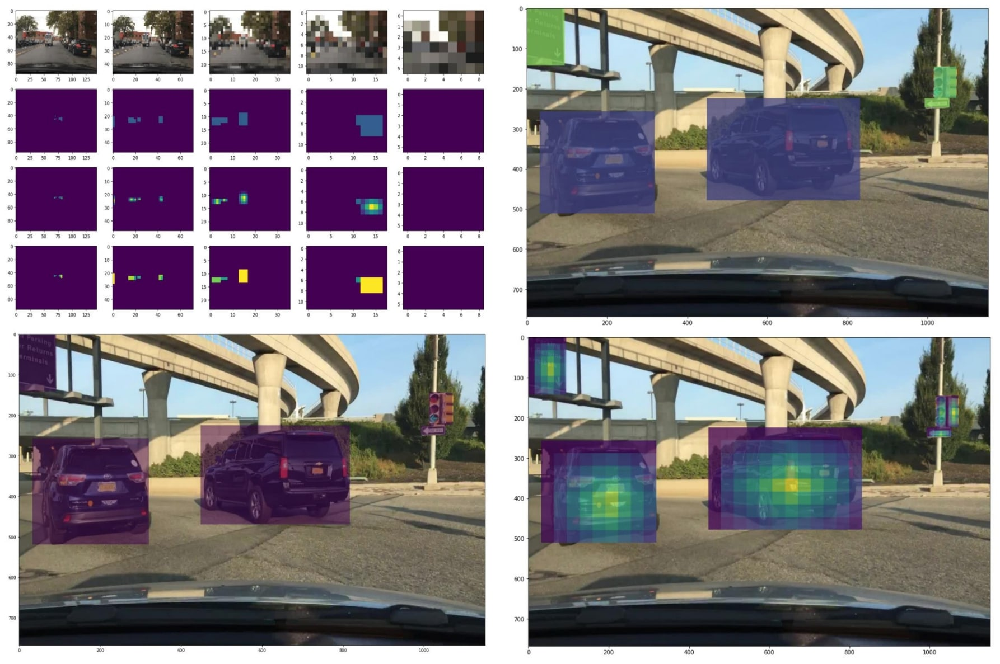

# fcos-improved
<p align="center">

</p>
This project aimed to implement a deep neural network for object detection and semantic segmentation in roadway images. The model detects various objects, including cars, pedestrians, buses, trucks, bicycles, motorcyclists, traffic signs, and traffic lights. Additionally, the model segments pixels belonging to road lanes designated in the direction of the vehicle.


The implementation is a modular, parametrized model based on the FCOS architecture, adapted for semantic segmentation. The code includes changes proposed to improve the overall quality of object detection and classification, as well as data generators to convert input images into labels compatible with the model. The resulting code is written in Python and based on the PyTorch library, with scripts for training the model, performance evaluation, and inference.
# Labels generator
<p align="center">

</p>
FCOS expects 3 labels: centerness, regression and classifiction labels. These must be created object size wise. 
The code is available in this repository and can be used for both generating labels, inferencing and training, with the option to fine-tune the model on a custom dataset for specific use cases.


# Usage
## Installing
Prerequisite: PyTorch installed
```bash
    git clone https://github.com/Maciejeg/fcos-improved
    cd fcos-improved
    pip install -e .
    pip install gin-config tqdm wandb torchmetrics
```
Training process utilizes wandb for monitoring. 
# Training
Training procedure is fully configurable in scripts/config.gin file. By default models are trained using pretrained backbones. In order to run training only one `build_datasets.root=...` must be updated. Keep in mind that this repository is compatible with BDD100K dataset only. Training for other tasks might require transforming the original data into bdd100k format. 
```python
    python scripts/train.py
```
# Inference
```python
    python scripts/evaluate_mode.py
```
# Example output


## Original work
```bib
@article{DBLP:journals/corr/abs-1904-01355,
  author       = {Zhi Tian and
                  Chunhua Shen and
                  Hao Chen and
                  Tong He},
  title        = {{FCOS:} Fully Convolutional One-Stage Object Detection},
  journal      = {CoRR},
  volume       = {abs/1904.01355},
  year         = {2019},
  url          = {http://arxiv.org/abs/1904.01355},
  eprinttype    = {arXiv},
  eprint       = {1904.01355},
  timestamp    = {Tue, 07 Mar 2023 08:43:10 +0100},
  biburl       = {https://dblp.org/rec/journals/corr/abs-1904-01355.bib},
  bibsource    = {dblp computer science bibliography, https://dblp.org}
}
```